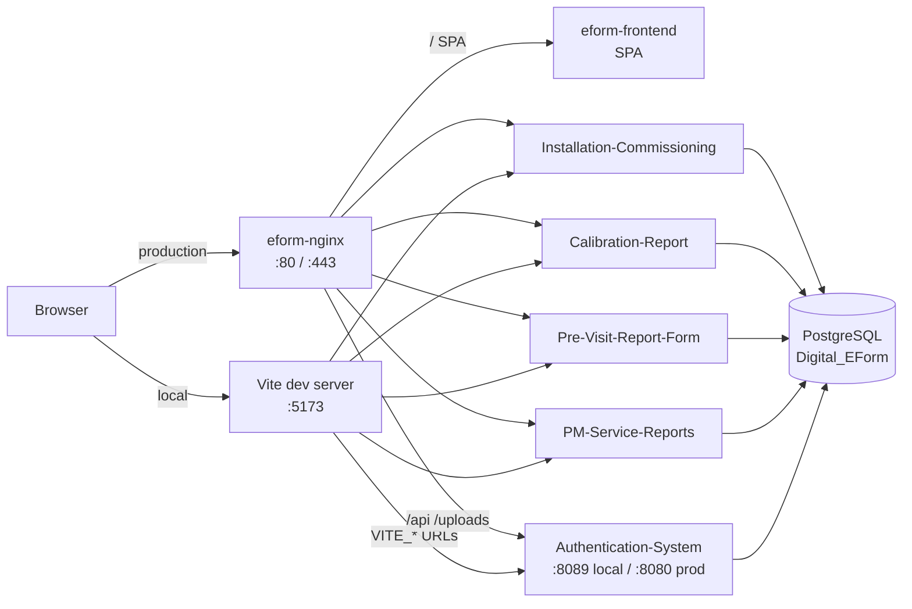

# Digital Installation & PM Visit E-Form System

Field engineers at **FloroSense** use this platform to fill, submit, and review digital service reports instead of paper forms. It covers the full site-visit lifecycle: pre-visit checks, installation & commissioning, sensor calibration, and preventive maintenance.

The app is a **React frontend** talking to **five Spring Boot microservices**. Each report type has its own service. Users sign in with JWT. Reports are stored in **PostgreSQL**. Completed reports can be viewed in the browser and exported as PDF.

---

## Table of contents

- [What this system does](#what-this-system-does)
- [Features](#features)
- [Architecture](#architecture)
- [Tech stack — what is used where](#tech-stack--what-is-used-where)
- [How the forms work](#how-the-forms-work)
- [Authentication and roles](#authentication-and-roles)
- [How a request flows](#how-a-request-flows)
- [Project structure](#project-structure)
- [Local development](#local-development)
- [Docker / production](#docker--production)
- [Environment variables](#environment-variables)
- [API overview](#api-overview)

---

## What this system does

FloroSense installs and maintains environmental sensors at client sites. Engineers previously filled paper checklists on site. This system replaces that with four digital e-forms:

| Form | When it is used |
| --- | --- |
| **Pre-Visit Report** | Before installation — confirm power, mounting, sensor location, internet, LED placement, and client scope |
| **Installation & Commissioning** | After equipment is installed — record equipment, work activities, site photos, and dual sign-off |
| **Calibration Report** | When a sensor is calibrated — capture before/after readings, master reference instrument, and engineer declaration |
| **Preventive Maintenance (PM)** | During scheduled service visits — inspect the sensor, record checklist results, observations, and sign-off |

A **dashboard** shows report counts, notifications, and shortcuts to create or view each form. **Admins** can edit and delete reports; **users** can create and view them.

---

## Features

- Email/password registration and login with JWT (24-hour token)
- Role-based access: `USER` (create + view) and `ADMIN` (create + view + edit + delete)
- Four independent report modules, each backed by its own microservice
- Auto-generated report numbers (for example `PM-2026-0001`, `FESPL_CAL_YYYYMMDD_0001`)
- Site image upload for pre-visit and installation reports (stored in PostgreSQL as binary, returned as Base64)
- Customer and technician signatures (typed names)
- Client-side PDF export of completed reports (`html2canvas` + `jsPDF`)
- In-app notifications when reports are created
- Search, date filters, and list views for every report type
- Docker Compose + Nginx reverse proxy for production (SPA and APIs on one origin)

---

## Architecture



**Locally**, the Vite app calls each service on its own port using `VITE_*_SERVICE_URL` in `frontend/.env`.

**In production**, Docker Compose runs the five APIs **and** the React SPA on an internal network. **Nginx** is the only public entry point (`https://digitalform.florosense.com`). It routes by path:

| Public path | Service |
| --- | --- |
| `/` (SPA routes such as `/login`) | Frontend (`eform-frontend`) |
| `/api/auth`, `/api/notifications` | Authentication |
| `/api/pm_reports` | Preventive Maintenance |
| `/api/previsit-reports` | Pre-Visit |
| `/api/calibration-reports` | Calibration |
| `/api/installation-reports` | Installation |

There is also a **Spring Cloud Gateway** module (`Api-Gateway`, port `7070`) for optional local routing. Production uses **Nginx**, not that gateway.

---

## Tech stack — what is used where

### Frontend (`frontend/`)

| Library | Used for |
| --- | --- |
| **React 19** | UI |
| **Vite 8** | Dev server and production build |
| **React Router 7** | Pages and protected routes |
| **Axios** | HTTP calls to the five APIs |
| **React Toastify** | Success / error toasts |
| **html2canvas + jsPDF** | Download reports as PDF |
| **react-icons** | Icons |

Service URLs live in `frontend/src/config/env.js` and come from Vite env vars (`VITE_AUTH_SERVICE_URL`, and so on). The JWT is stored in `localStorage` and sent as `Authorization: Bearer <token>`.

### Backend (each `*-Report` / `Authentication-System` folder)

| Technology | Used for |
| --- | --- |
| **Java 17** | Runtime |
| **Spring Boot 3.5.x** | REST APIs |
| **Spring Security** | JWT filter, CORS, public vs protected endpoints |
| **Spring Data JPA + Hibernate** | Persistence (`ddl-auto=update`) |
| **PostgreSQL** | Shared database `Digital_EForm` |
| **JJWT 0.12.6** | Sign and verify tokens (same `JWT_SECRET` on every service) |
| **BCrypt** | Password hashing (auth service only) |
| **Bean Validation** | Request DTOs |
| **Lombok** | Boilerplate reduction |
| **Spring Actuator** | Health checks (used by Docker Compose) |
| **Maven** | Build |

### Infrastructure

| Piece | Used for |
| --- | --- |
| **Docker + Docker Compose** | Run the five APIs, the SPA, and Nginx together |
| **Nginx (alpine)** | Path-based reverse proxy + TLS, 25 MB upload limit |
| **PostgreSQL** | One database for all services (tables per module) |
| **Api-Gateway** | Optional Spring Cloud Gateway for local development |

---

## How the forms work

Every form follows the same pattern:

1. User logs in. The auth service returns a JWT plus name, email, and role.
2. The frontend stores the token and sends it on every API call.
3. The matching microservice validates the JWT, then creates or updates a row in PostgreSQL.
4. The dashboard refreshes counts. A notification is created for admins.
5. Anyone logged in can open the report. Only **ADMIN** can edit or delete.

Edit URLs are wrapped in `AdminRoute`. Non-admins are redirected to the list page.

### 1. Preventive Maintenance (`PM-Service-Reports`)

A **6-step wizard** (`frontend/src/pages/PMReportWizard.jsx`). Data is kept in React state until the last step submits one JSON payload to `POST /api/pm_reports`.

| Step | Screen | What the engineer fills |
| --- | --- | --- |
| 1 | Basic info | Client, site, sensor ID, engineer, visit date. Report number `PM-YYYY-XXXX` is generated. Visit number uses the live visit count for that sensor (`FESPL_{sensorId}_{count}`). |
| 2 | Inspection | Physical inspection and power-supply checklist items (Yes / No + remark). |
| 3 | Technical | Sensor health, communication, calibration verification, and cleaning. |
| 4 | Summary | Observations, recommendations, PM status (`SATISFACTORY`, `FOLLOW_UP_VISIT_REQUIRED`, `REQUIRES_ATTENTION`), and site condition after PM. |
| 5 | Sign-off | Client and service-engineer names, dates, and signatures. |
| 6 | Review | Full preview, then submit. |

Checklist rows are stored as child records (`PreventiveMaintenanceChecklist`) with categories:

- `PHYSICAL_INSPECTION`
- `POWER_SUPPLY`
- `SENSOR_HEALTH`
- `COMMUNICATION`
- `CALIBRATION_PERFORMANCE_VERIFICATION`
- `CLEANING_ACTIVITY`

Local ports: **8090**. Table: `pm_reports`.

### 2. Pre-Visit Report (`Pre-Visit-Report-Form`)

A single-page form used **before** installation. The engineer records site contacts and a six-item readiness checklist:

1. Stabilized 230 V power supply
2. Controller mounting structure (wall / pole)
3. Sensor placement location
4. Internet connectivity requirement
5. LED installation location
6. Client scope of work

Each item is Yes / No plus an optional remark. Site photos are uploaded after the report is created (`POST /api/previsit-reports/images/upload/{reportId}`). Images are stored as `bytea` in PostgreSQL and returned as Base64 data URIs. Customer and technician sign on a canvas.

Local ports: **8088**. Table: `pre_visit_reports`.

### 3. Calibration Report (`Calibration-Report`)

Used when a sensor is calibrated against a master reference instrument.

The form captures:

- Client, site, sensor ID, model, serial number
- Certificate number (`FESPL_CAL_YYYYMMDD_XXXX`)
- Calibration date and due date (due date defaults to +90 days)
- Master reference instrument details
- Readings **before** and **after** calibration
- Summary flags: successful, adjustment performed, within limits, needs replacement
- Standard declaration text and engineer name + signature

Submit is one JSON body to `POST /api/calibration-reports`. Related rows (instrument, readings, summary, engineer) are saved with cascade.

Local ports: **8087**. Table: `calibration_reports`. IDs are UUIDs.

### 4. Installation & Commissioning (`Installation-Commisioning-Report`)

Used after hardware is installed on site.

The form captures:

- Auto-generated report number
- Company, site address, customer contact
- Equipment list (model, serial, quantity)
- Work-activity checkboxes (unboxing, sensor/controller install, LED, wiring, functionality check, power, internet, safety briefing, other)
- Remark and work confirmation
- Site photos (same Base64 / `bytea` pattern as pre-visit)
- Customer and technician confirmation names and signatures

Local ports: **8086**. Table: `installation_reports`.

### Dashboard and PDF

The dashboard (`/dashboard`) loads `/count` from each service and caches totals for two hours. Notifications poll every 20 seconds.

List pages support search, selection (admin bulk delete), and open-in-view. View pages can **print / download PDF** by capturing the report DOM with `html2canvas` and writing an A4 PDF with `jsPDF`.

---

## Authentication and roles

| Role | Can do |
| --- | --- |
| **USER** (default on signup) | Register, log in, create reports, view lists and details, export PDF |
| **ADMIN** | Everything a user can do, plus edit and delete reports |

Signup fields: name, email, 10-digit Indian mobile (`^[6-9]\d{9}$`), password (min 8 characters), optional role.

Passwords are hashed with **BCrypt**. Login returns a JWT signed with the shared `JWT_SECRET`. Every report service runs the same JWT filter so a token from auth is accepted everywhere.

Protected UI routes use `ProtectedRoute` (valid token required). Edit routes use `AdminRoute` (`canModifyReports()` is true only for `ADMIN`).

---

## How a request flows

Example: saving a new PM report.

```
Engineer (browser)
  → Login POST /api/auth/login  → Authentication-System
  ← JWT stored in localStorage

  → Wizard steps 1–6 (client-side validation only)
  → POST /api/pm_reports  + Authorization: Bearer <jwt>
       → Nginx (prod) or direct :8090 (local)
       → PM-Service-Reports JwtAuthFilter
       → PreventiveMaintenanceService.saveReport()
       → PostgreSQL (pm_reports + checklists + sign-off)
  ← Created report JSON

  → Dashboard GET /api/pm_reports/count
  → Notification POST /api/notifications
```

Images (pre-visit / installation) are a second call after the report ID exists. Multipart files are read as bytes and stored in the database, not as public files on disk (Docker still bind-mounts upload folders for temp / static serving).

---

## Project structure

```
Digital_Installation_PM_Visit_E-Form_System/
├── frontend/                          React + Vite UI
│   ├── src/pages/                     Login, Signup, Dashboard, wizards
│   ├── src/components/                PM, pre-visit, calibration, installation
│   ├── src/api/  src/services/        Axios clients per microservice
│   └── src/config/env.js              Service base URLs
├── Authentication-System/             Login, register, notifications  :8089
├── PM-Service-Reports/                Preventive maintenance          :8090
├── Pre-Visit-Report-Form/             Pre-visit checklists + images   :8088
├── Calibration-Report/                Calibration certificates        :8087
├── Installation-Commisioning-Report/  Installation reports + images   :8086
├── Api-Gateway/                       Optional Spring Cloud Gateway   :7070
├── nginx/                             Reverse-proxy config for Docker
├── docker-compose.yml                 Five APIs + frontend + Nginx
├── .env.example                       Backend / Compose secrets template
└── deploy/hostinger.md                VPS deploy notes
```

Each backend follows the usual Spring layout: `controller` → `service` → `repository` → `entity`, plus `security` (JWT) and `dto`.

---

## Local development

### Prerequisites

- Java 17
- Maven 3.9+
- Node.js 20+
- PostgreSQL 14+ with a database named `Digital_EForm`

### 1. Database

Create the database (Hibernate creates tables on startup):

```sql
CREATE DATABASE "Digital_EForm";
```

Default local JDBC settings (see each `application.properties`):

```
jdbc:postgresql://localhost:5432/Digital_EForm
username: postgres
```

Set a real password in properties or environment variables. Do not commit credentials.

`JWT_SECRET` **must be identical** on the auth service and every report service.

### 2. Start the APIs

From each service folder (order does not matter; start auth first if you want login immediately):

```bash
cd Authentication-System && mvn spring-boot:run
cd PM-Service-Reports && mvn spring-boot:run
cd Pre-Visit-Report-Form && mvn spring-boot:run
cd Calibration-Report && mvn spring-boot:run
cd Installation-Commisioning-Report && mvn spring-boot:run
```

Optional gateway:

```bash
cd Api-Gateway && mvn spring-boot:run
```

### 3. Start the frontend

```bash
cd frontend
cp .env.example .env
```

For local APIs, point every URL at localhost and the ports above, for example:

```
VITE_AUTH_SERVICE_URL=http://localhost:8089
VITE_PM_SERVICE_URL=http://localhost:8090
VITE_PREVISIT_SERVICE_URL=http://localhost:8088
VITE_CALIBRATION_SERVICE_URL=http://localhost:8087
VITE_INSTALLATION_SERVICE_URL=http://localhost:8086
```

Then:

```bash
npm install
npm run dev
```

Open **http://localhost:5173**. Register an account, then log in. Use role `ADMIN` only for accounts that should edit/delete reports.

---

## Docker / production

```bash
cp .env.example .env
# Fill SPRING_DATASOURCE_*, JWT_SECRET, CORS_ALLOWED_ORIGINS

docker compose up -d --build
```

Compose starts `eform-auth`, `eform-pm`, `eform-previsit`, `eform-calibration`, `eform-installation`, `eform-frontend`, and `eform-nginx`. Nginx listens on port **80** and **443** (override with `NGINX_HTTP_PORT` / `NGINX_HTTPS_PORT`). Postgres is expected on the host (`host.docker.internal`) or another container you configure in `SPRING_DATASOURCE_URL`.

The frontend is **`eform-frontend`** in the same Compose file. Leave `VITE_*_SERVICE_URL` **empty** in that image so the SPA calls same-origin `/api`. `eform-nginx` routes `/api` and `/uploads` to the Spring services and `/` to the SPA. Signup is hidden in production builds (`VITE_ENABLE_SIGNUP=false`). Point `digitalform.florosense.com` at the VPS and enable Let’s Encrypt as in [`deploy/hostinger.md`](deploy/hostinger.md) Step 9. Render is not used for production.

On a 4 GB VPS, build the UI first so Node/Vite does not compete with the JVMs: `docker compose build frontend` then `docker compose up -d --build`.

More VPS detail: [`deploy/hostinger.md`](deploy/hostinger.md). To update an existing VPS deploy without rotating `JWT_SECRET`, see **Updating an existing deployment** in that file, or run `./deploy/redeploy.sh`. A new `eform-auth:latest` image ID after rebuild is normal; recreate containers instead of copying `.env.example` over `.env`.

---

## Environment variables

**Backend / Compose** (root `.env`, see `.env.example`):

| Variable | Purpose |
| --- | --- |
| `SPRING_DATASOURCE_URL` | JDBC URL for PostgreSQL |
| `SPRING_DATASOURCE_USERNAME` / `PASSWORD` | DB credentials |
| `JWT_SECRET` | Shared signing key (all five services) |
| `JWT_EXPIRATION` | Token lifetime in ms (default 86400000 = 24 h) |
| `CORS_ALLOWED_ORIGINS` | Allowed frontend origins |
| `JAVA_OPTS` | Heap size, e.g. `-Xmx256m` on a 4 GB VPS |
| `NGINX_HTTP_PORT` | Public HTTP port (default 80) |
| `NGINX_HTTPS_PORT` | Public HTTPS port (default 443) |
| `AUTH_REGISTRATION_ENABLED` | Auth service public signup (`true` until VPS users exist) |

**Frontend** (`frontend/.env`):

| Variable | Purpose |
| --- | --- |
| `VITE_AUTH_SERVICE_URL` | Origin of the auth API (empty in production) |
| `VITE_PM_SERVICE_URL` | Origin of the PM API (empty in production) |
| `VITE_PREVISIT_SERVICE_URL` | Origin of the pre-visit API (empty in production) |
| `VITE_CALIBRATION_SERVICE_URL` | Origin of the calibration API (empty in production) |
| `VITE_INSTALLATION_SERVICE_URL` | Origin of the installation API (empty in production) |
| `VITE_ENABLE_SIGNUP` | `true` to show `/signup` (on by default in `npm run dev`) |

Locally, point each `VITE_*_SERVICE_URL` at localhost ports. Production Compose builds leave them empty (same-origin `/api` via `eform-nginx`). Restart Vite (or rebuild the frontend image) after changing these.

---

## API overview

All report endpoints except login/register require `Authorization: Bearer <jwt>`.

### Auth — `/api/auth`

| Method | Path | Description |
| --- | --- | --- |
| `POST` | `/api/auth/register` | Create user |
| `POST` | `/api/auth/login` | Return JWT |
| `GET` | `/api/auth/ping` | Health ping |

### Notifications — `/api/notifications`

| Method | Path | Description |
| --- | --- | --- |
| `GET` | `/api/notifications` | List for current user |
| `POST` | `/api/notifications` | Create |
| `PATCH` | `/api/notifications/{id}/read` | Mark one read |
| `POST` | `/api/notifications/read-all` | Mark all read |
| `DELETE` | `/api/notifications/{id}` | Delete one |
| `DELETE` | `/api/notifications` | Clear all |

### PM — `/api/pm_reports`

`GET /count`, `GET /`, `GET /{id}`, `POST /`, `PUT /{id}`, `DELETE /{id}`, `GET /sensor/{sensorId}/count`, `GET /by-number/{serviceReportNo}`

### Pre-visit — `/api/previsit-reports`

CRUD plus `GET /search`, `GET /company`, `GET /date-range`, `GET /count`, and `/images/upload/{reportId}` (multipart).

### Calibration — `/api/calibration-reports`

CRUD plus `GET /report-number/{reportNo}`, `GET /client/{clientName}`, `GET /search`, `GET /count`.

### Installation — `/api/installation-reports`

CRUD plus `GET /generate-report-number`, `GET /installed-by/{name}`, image upload under `/images/upload/{reportId}`.

---

## License

Private project for FloroSense. All rights reserved unless a license file is added to this repository.
