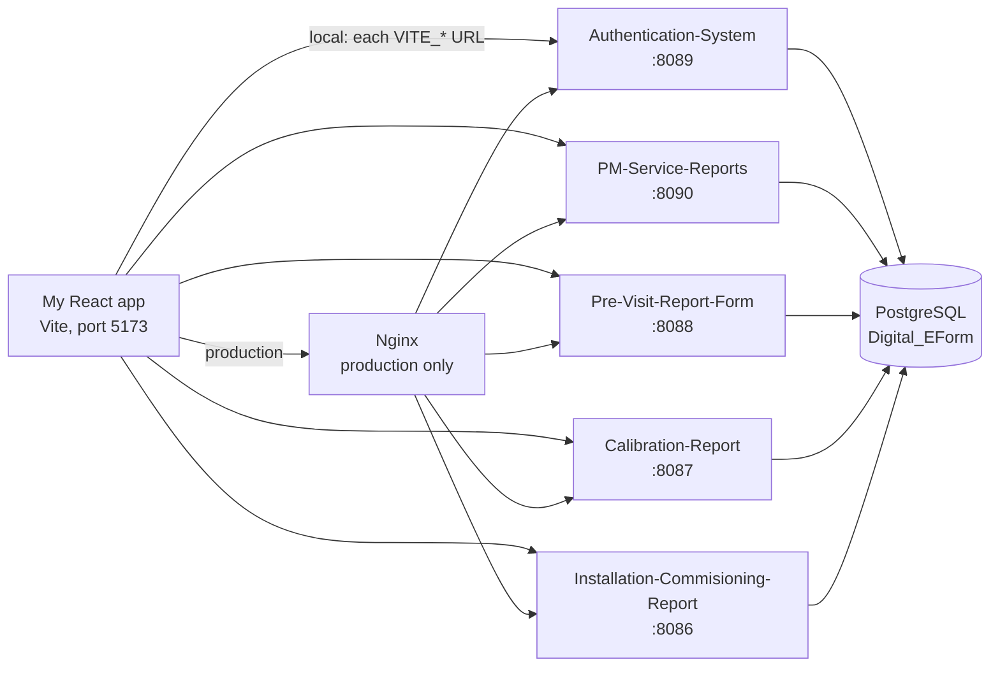

# How my Digital E-Form system works

I wrote this so I understand the **flow of my own code** — from the browser click to PostgreSQL and back. I use it to explain the project in interviews.

The product overview (features, setup, APIs) is in [`README.md`](README.md). This file is **how the code runs and why I chose each piece**.

---

## Table of contents

- [What I built](#what-i-built)
- [How I think about the architecture](#how-i-think-about-the-architecture)
- [Where the code lives](#where-the-code-lives)
- [How a user reaches a page](#how-a-user-reaches-a-page)
- [Signup flow](#signup-flow)
- [Login flow](#login-flow)
- [How the JWT travels on every later request](#how-the-jwt-travels-on-every-later-request)
- [Roles — USER vs ADMIN](#roles--user-vs-admin)
- [Dashboard flow](#dashboard-flow)
- [PM report flow (the 6-step wizard)](#pm-report-flow-the-6-step-wizard)
- [Pre-visit, calibration, and installation flows](#pre-visit-calibration-and-installation-flows)
- [How images are uploaded](#how-images-are-uploaded)
- [How I generate PDFs](#how-i-generate-pdfs)
- [Notification flow](#notification-flow)
- [How I structured each Spring service](#how-i-structured-each-spring-service)
- [How data is stored](#how-data-is-stored)
- [Caching](#caching)
- [Local vs production request path](#local-vs-production-request-path)
- [Why I used each technology](#why-i-used-each-technology)
- [Trade-offs I made](#trade-offs-i-made)
- [How I explain this in an interview](#how-i-explain-this-in-an-interview)

---

## What I built

Field engineers at FloroSense used paper forms. I replaced that with a web app where they fill four digital reports:

1. **Pre-visit** — before install, is the site ready?
2. **Installation & commissioning** — what was installed, with photos and sign-off?
3. **Calibration** — before/after readings against a master instrument?
4. **Preventive maintenance (PM)** — scheduled inspection checklist?

I built a **React** frontend and **five Spring Boot microservices**. Users log in once. I store reports in **PostgreSQL**. Completed reports can be viewed in the browser and downloaded as PDF.

---

## How I think about the architecture



I split the backend into five services so each report type has its own API. Login lives in `Authentication-System`. The other four only care about their own tables.

**Why microservices instead of one Spring app?**  
A bug in calibration should not take down login or PM. I can restart one service. The forms also have different shapes (PM has child checklists, calibration uses UUIDs, pre-visit stores photos as `BYTEA`).

**What I did not split:** I still use **one PostgreSQL database** (`Digital_EForm`). Each service owns its own tables. That is simpler on a small VPS than five databases.

On my laptop the React app calls each service by port. In production Docker Compose runs the five APIs on an internal network and **Nginx** is the only public entry. I also have an `Api-Gateway` module (Spring Cloud Gateway on port 7070) for optional local routing, but production uses Nginx.

---

## Where the code lives

```
Digital_Installation_PM_Visit_E-Form_System/
├── frontend/                          React + Vite
│   ├── src/main.jsx                   BrowserRouter starts here
│   ├── src/App.jsx                    All routes
│   ├── src/pages/                     Login, Signup, Dashboard, PM wizard
│   ├── src/components/                Forms, lists, ProtectedRoute, AdminRoute
│   ├── src/services/  src/api/        Axios clients
│   └── src/config/env.js              Reads VITE_* URLs
├── Authentication-System/             Login, register, notifications
├── PM-Service-Reports/
├── Pre-Visit-Report-Form/
├── Calibration-Report/
├── Installation-Commisioning-Report/
├── Api-Gateway/                       Optional, local only
├── Thread-Starvation/                 Optional Hikari / thread-pool monitor
├── nginx/                             Path-based reverse proxy
└── docker-compose.yml
```

Every backend follows the same path:

`controller` → `service` → `mapper` (if I have one) → `repository` → `entity` → PostgreSQL

The controller never talks to the database. I did that so HTTP, business rules, and persistence stay separate.

---

## How a user reaches a page

The app starts in `frontend/src/main.jsx`. I wrap everything in `BrowserRouter`, then render `App.jsx`.

In `App.jsx` I defined three kinds of routes:

| Kind | Wrapper | Examples |
| --- | --- | --- |
| Public | none | `/login`, `/signup` |
| Logged in | `ProtectedRoute` | `/dashboard`, create/view reports |
| Admin only | `ProtectedRoute` + `AdminRoute` | `/pm-reports/edit/:id` and the other edit URLs |

**`ProtectedRoute.jsx`** reads `token` from `localStorage` and calls `authService.validateToken()`. That function only decodes the JWT payload and checks `exp`. If there is no token or it is expired, I `Navigate` to `/login`.

**`AdminRoute.jsx`** calls `canModifyReports()` from `utils/roles.js`. That is true only when the stored role is `ADMIN`. Otherwise I redirect to the list page.

So the UI flow is:

```
URL change
  → React Router matches a Route in App.jsx
  → ProtectedRoute: is there a valid token?
       no  → /login
       yes → render the page
  → if it is an edit URL, AdminRoute: is role ADMIN?
       no  → list page
       yes → edit form
```

I know the UI check is not real security. The APIs also reject PUT/DELETE unless the JWT has `ROLE_ADMIN`. I explain that later.

---

## Signup flow

I start on `frontend/src/pages/Signup.jsx`.

1. The user fills name, email, 10-digit Indian mobile (`^[6-9]\d{9}$`), password (min 8), confirm password, optional role (default `USER`).
2. I call `authService.register()` in `frontend/src/services/authService.js`.
3. That uses the Axios instance in `frontend/src/services/api.js`, whose `baseURL` is `VITE_AUTH_SERVICE_URL + /api`.
4. Request: `POST /api/auth/register`.

On the backend:

`AuthController.register()` → `AuthServiceImpl.register()`

I check that email and phone are not already in the `users` table. I hash the password with **BCrypt** (`passwordEncoder.encode`). I only allow role `USER` or `ADMIN`; anything else becomes `USER`. Then I `userRepository.save(user)`.

I do not log the user in automatically. After signup they go to `/login`.

**Why BCrypt?** I never store the real password. BCrypt is a slow hash, so if the `users` table leaks, cracking passwords is expensive.

---

## Login flow

This is the path I walk through first in an interview, because everything else depends on it.

### Frontend

`frontend/src/pages/Login.jsx`

1. If a token is already valid, I send them straight to `/dashboard`.
2. On submit I call `authService.login({ email, password })`.
3. Axios `POST /api/auth/login` (no Bearer header — `api.js` skips the token for login/register).
4. On success I store:

   - `token`
   - `userName`
   - `userRole`
   - `userEmail`

   then I fire `eform-auth-changed` so the notification context reloads, and I `navigate("/dashboard")`.

### Backend

`AuthController.login()` → `AuthServiceImpl.login()`

```
POST /api/auth/login  { email, password }
  → AuthenticationManager.authenticate(...)
       → CustomUserDetailsService.loadUserByUsername(email)
            → UserRepository.findByEmail
            → wrap in CustomUserDetails
       → BCrypt matches request password vs stored hash
  → JwtService.generateToken(email, role, name)
  → LoginResponse { token, role, name, email }
```

`SecurityConfig` in the auth service permits `/api/auth/**` without a token. `JwtAuthFilter` also skips `/api/auth/` and `/actuator/` via `shouldNotFilter`.

### What I put inside the JWT

In `JwtService.java` I set claims `role`, `name`, `email`, subject = email, issued-at, expiry (24 hours). I sign with HMAC using `JWT_SECRET` (at least 32 bytes). Every report service uses the **same** secret so they can verify a token they did not create.

**Why JWT instead of server sessions?** I have five APIs. A session in one JVM would not exist in the others unless I added Redis. A JWT is self-contained. PM does not call auth on every request — it only verifies the signature.

**Why Spring Security is STATELESS and CSRF is off:** I send the token in the `Authorization` header, not as a cookie. CSRF is a problem when the browser attaches cookies automatically. I still set CORS so only my frontend origins can call the APIs from a browser.

---

## How the JWT travels on every later request

After login, almost every HTTP call goes through an Axios instance or `fetch` with `getAuthHeaders()`.

```
React component
  → axios / fetch
  → interceptor in api.js (or axiosConfig.js, or getAuthHeaders)
  → header: Authorization: Bearer <token>
  → (local) http://localhost:8090/...
     or (prod) http://<nginx>/api/pm_reports
  → JwtAuthFilter on that service
       1. Read Authorization
       2. jwtService.isTokenValid(token)  — signature + expiry
       3. extract email and role
       4. if role is ADMIN, authority becomes ROLE_ADMIN
       5. put UsernamePasswordAuthenticationToken into SecurityContextHolder
  → Spring Security filter chain
       GET/POST  → any authenticated user
       PUT/PATCH/DELETE → hasRole("ADMIN")
  → Controller
```

If the token is missing or invalid, the API returns **401**. My Axios response interceptor calls `handleUnauthorizedResponse` in `utils/authSession.js`. I only log the user out on 401, not on 403. 403 means they are logged in but not allowed (for example a USER hitting DELETE). Logging them out for 403 would be wrong.

On the client, `ProtectedRoute` only checks expiry by decoding the payload. It does **not** check the signature. The signature check always happens on the server.

---

## Roles — USER vs ADMIN

| | USER (default on signup) | ADMIN |
| --- | --- | --- |
| Create reports | yes | yes |
| View lists and details, PDF | yes | yes |
| Edit / delete | no | yes |

I enforce this twice on purpose (**defense in depth**):

1. **UI** — `AdminRoute` + `canModifyReports()` so a normal user never sees an edit screen.
2. **API** — in each report service `SecurityConfig`, for example PM:

   - `PUT /api/**` → `hasRole("ADMIN")`
   - `PATCH /api/**` → `hasRole("ADMIN")`
   - `DELETE /api/**` → `hasRole("ADMIN")`
   - `GET` and `POST` → authenticated

Anyone can call the API with curl. Without `ROLE_ADMIN` in the JWT they get 403. Hiding a button is not enough.

`hasRole("ADMIN")` expects the authority `ROLE_ADMIN`. That is why `JwtAuthFilter` prefixes `ROLE_` if it is missing.

---

## Dashboard flow

After login I land on `frontend/src/pages/Dashboard.jsx`.

1. I wrap the app in `NotificationProvider` (`App.jsx`), so the bell on the dashboard has data.
2. I load report counts. If `dashboard_data` in `localStorage` is younger than **2 hours**, I show the cache and skip the network.
3. Otherwise I run `Promise.allSettled` on:

   - `GET {PM}/api/pm_reports/count`
   - `GET {PREVISIT}/api/previsit-reports/count`
   - `GET {CALIBRATION}/api/calibration-reports/count`
   - `GET {INSTALLATION}/api/installation-reports` (I take `array.length`)

   Each request carries the Bearer token. `allSettled` means if one service is down, the others still show.

4. I save the counts back to `localStorage`.
5. Every **20 seconds** I refresh notifications from `GET /api/notifications`.

That is why the dashboard can still open when one microservice is down — counts for that module just show 0.

---

## PM report flow (the 6-step wizard)

This is the longest flow in the project. I use it as my “walk me through a feature” example.

### Create (new report)

Page: `frontend/src/pages/PMReportWizard.jsx`  
Route: `/pm-reports` or `/pm-reports/new` (inside `ProtectedRoute`)

I keep one React state object for the whole wizard:

```js
formData = {
  report,      // step 1
  inspection,  // step 2
  technical,   // step 3
  summary,     // step 4
  signoff,     // step 5
  checklists,  // flattened Yes/No rows
}
```

Each step is a child component. I pass `formData` and `setFormData` down. That is **lifting state up** so step 6 can preview everything without extra API calls. Nothing is saved to the database until the last step.

| Step | File | What the engineer fills |
| --- | --- | --- |
| 1 | `Step1BasicInfo.jsx` | Client, site, sensor ID, engineer, date. Report number `PM-YYYY-XXXX`. Visit number `FESPL_{sensorId}_{count}` from `GET /api/pm_reports/sensor/{sensorId}/count` |
| 2 | `Step2Inspection.jsx` | Physical inspection + power supply |
| 3 | `Step3Technical.jsx` | Sensor health, communication, calibration check, cleaning |
| 4 | `Step4Summary.jsx` | Observation, recommendation, PM status, site condition |
| 5 | `Step5SignOff.jsx` | Client + engineer names, dates, signatures |
| 6 | `Step6Review.jsx` | Full preview, then submit |

`ProgressBar.jsx` only displays which step is active.

On submit, `handleSubmit` in `PMReportWizard.jsx`:

1. Validates client name, site, date, PM status, site condition, report number, sensor ID.
2. Builds one JSON payload (`checklists` + `signOff` + summary fields).
3. `POST {VITE_PM_SERVICE_URL}/api/pm_reports` with `getAuthHeaders()`.

### Backend save

```
PreventiveMaintenanceController.saveReport(@Valid PMReportRequest)
  → PreventiveMaintenanceServiceImpl.saveReport()
       → check duplicate serviceReportNo
       → PMMapper / manual mapping to PreventiveMaintenanceReport
       → attach checklist children (category enum + YES/NO)
       → attach sign-off child
       → repository.save(parent)
            Hibernate cascade ALL writes:
              pm_reports
              checklist rows
              pm_sign_off
       → @CacheEvict list + count caches
  → 201 + PMReportResponse JSON
```

`PreventiveMaintenanceReport` has:

- `@OneToMany` checklists with `cascade = ALL`, `orphanRemoval = true`
- `@OneToOne` sign-off with the same cascade

So one `save(parent)` persists the whole document. If I delete the report, children go too.

After a successful POST I:

- `invalidate('pm_reports')` so the list cache is stale
- clear dashboard count cache
- `notificationService.reportCreated(...)` which POSTs to `/api/notifications`
- navigate to the list / view

### Edit (admin only)

Route: `/pm-reports/edit/:id` → `AdminRoute` then the same wizard with `isEditMode`.

1. `GET /api/pm_reports/{id}`
2. I map checklist rows back into `inspection` / `technical` so steps 2 and 3 show the saved Yes/No values.
3. I freeze `serviceReportNo`, `serviceVisitNo`, and `sensorId` in `originalImmutableFields` so an edit cannot change identity fields.
4. Submit is `PUT /api/pm_reports/{id}` — backend requires `ROLE_ADMIN`.

### View and list

- List: `ViewReports.jsx` → `GET /api/pm_reports` (summary DTOs, not full checklists).
- Detail: `PMReportView.jsx` → `GET /api/pm_reports/{id}`.

---

## Pre-visit, calibration, and installation flows

Same idea as PM: form in React → JWT → that module’s controller → service → PostgreSQL. Differences:

### Pre-visit (`Pre-Visit-Report-Form`, port 8088)

Single page `PreVisitReportForm.jsx`, not a wizard.

1. Engineer fills contacts + six Yes/No items (power, mounting, sensor location, internet, LED, client scope).
2. `POST /api/previsit-reports` creates the row (`pre_visit_reports`).
3. Photos are a **second** call once I have `reportId` (see images below).
4. Customer and technician signatures are TEXT columns (canvas data URL or typed name).

List/search: `usePreVisitReports.js` → `preVisitReportService`. Detail: `PreVisitReportDetail.jsx`.

### Calibration (`Calibration-Report`, port 8087)

Form: `CalibrationReportForm.jsx`. One JSON to `POST /api/calibration-reports`.

The entity `CalibrationReport` uses a **UUID** id and `@OneToOne(cascade = ALL)` for:

- master reference instrument
- reading before
- reading after
- summary flags
- engineer details

`ReportNumberGenerator` builds `FLO_CAL_yyyyMMdd` + a 4-digit sequence from `count() + 1`. Due date is typically +90 days.

### Installation (`Installation-Commisioning-Report`, port 8086)

Form: `InstallationReportForm.jsx`. Equipment is `@ElementCollection` (`report_equipment_details`). Work activities are booleans (unboxing, wiring, internet, safety briefing, …). Photos use the same upload pattern as pre-visit.

---

## How images are uploaded

I do not send photos in the first create JSON. The report row must exist first.

```
POST /api/previsit-reports                  → get reportId
POST /api/previsit-reports/images/upload/{reportId}   multipart file
```

Same pattern for installation: `/api/installation-reports/images/upload/{reportId}`.

On the server I read the file bytes and save a `SiteImage` / `InstallationSiteImage` row:

- `image_data` → PostgreSQL `BYTEA` (`byte[]` + `@Lob`)
- name, type, size, `report_id`

When the UI loads a report, the API returns a Base64 data URI so `` works without a public file server.

**Why the database instead of S3 / disk?** One `pg_dump` backs up reports and photos. Docker containers are disposable. The trade-off is larger DB rows and JSON. Nginx `client_max_body_size` is **25m** so the proxy does not reject the multipart request. Compose still bind-mounts `./data/previsit-uploads` and `./data/installation-uploads` for temp/static files.

---

## How I generate PDFs

There is no PDF service on the backend.

`frontend/src/utils/pdfGenerator.js`:

1. `html2canvas` takes a screenshot of the report DOM (`scale: 2`, white background, `useCORS: true` for images).
2. `jsPDF` writes A4 pages and `pdf.save(filename)`.

Some list pages also use `jspdf-autotable`. I generate the file **in the browser** so I do not add a PDF library to every microservice, and the PDF looks like the screen the engineer already reviewed.

---

## Notification flow

Notifications are **not** stored on the report services. They live on **auth**, because they belong to a user (email, read/unread), not to one report type.

After create/update/delete, `notificationService.js` shows a toast and `POST /api/notifications`.

```
NotificationController
  → reads Authentication.getName()  (email from the JWT)
  → NotificationService.create / listForUser / markRead
  → table app_notifications
```

On the frontend:

- `NotificationProvider` in `notificationContext.jsx` holds the list and unread count.
- It loads from `GET /api/notifications`, merges with `localStorage` keyed by email (`notifications_<email>`).
- Dashboard polls every 20 seconds.
- Mark read / clear all call PATCH/POST/DELETE on the same API.

I used **polling**, not WebSockets. It is simpler to deploy. 20 seconds is enough for an office admin watching the bell.

---

## How I structured each Spring service

Example: saving a PM report.

| Layer | What it does | Why I have it |
| --- | --- | --- |
| **Controller** | `@Valid` DTO in, HTTP status out | HTTP stays out of business logic |
| **DTO** | JSON shape the UI sends | Not the same as the table (nested `summary`, `checklists`) |
| **Service** | Duplicate checks, cascade children, `@Transactional`, cache evict | One place for rules |
| **Mapper** | PM uses MapStruct `PMMapper` | Compile-time DTO ↔ entity |
| **Repository** | `JpaRepository` + `@Query` | No JDBC boilerplate |
| **Entity** | Tables and relations | Hibernate maps to PostgreSQL |
| **GlobalExceptionHandler** | `@RestControllerAdvice` | 404 / 400 field errors / 500 without leaking stack traces |

If Bean Validation fails (`@NotBlank`, `@Pattern` on `PM-YYYY-XXXX`), Spring throws `MethodArgumentNotValidException` and I return 400 with field names. The row is never saved.

---

## How data is stored

One database, many tables:

| Service | Main tables |
| --- | --- |
| Auth | `users`, `app_notifications` |
| PM | `pm_reports`, checklist table, `pm_sign_off` |
| Pre-visit | `pre_visit_reports`, `previsit_site_images` |
| Calibration | `calibration_reports` + related one-to-one tables |
| Installation | `installation_reports`, `report_equipment_details`, image table |

I use `spring.jpa.hibernate.ddl-auto=update` so new entity fields create columns on startup. That is convenient while I iterate. For a stricter production setup I would switch to Flyway so schema changes are versioned.

IDs: most tables use `IDENTITY` (`Long`). Calibration uses UUID strings because I treat a certificate as an independent document.

PM status is an enum (`SATISFACTORY`, `FOLLOW_UP_VISIT_REQUIRED`, `REQUIRES_ATTENTION`) stored as VARCHAR through a converter so the column stays readable.

---

## Caching

I cache in three places because dashboard and lists are hit often, and reports do not change every second.

| Where | What | When it expires |
| --- | --- | --- |
| Dashboard `localStorage` | Counts | 2 hours, or I clear it after save |
| `frontend/src/utils/cache.js` | List pages (`app_cache:` keys) | 15 minutes; `invalidate()` on create/update/delete |
| Spring **Caffeine** | `@Cacheable` on list + count | 10 minutes, max 500 entries; `@CacheEvict` on writes |

Example: `PreventiveMaintenanceServiceImpl.getReportCount()` is `@Cacheable("pmReportCount")`. After `saveReport` I `@CacheEvict` that cache so the next dashboard load is not stale.

---

## Local vs production request path

**On my machine**

`frontend/.env` points each `VITE_*_SERVICE_URL` at `localhost` and ports 8086–8090. Vite (`npm run dev`) serves the UI on 5173. I start each API with `mvn spring-boot:run`. CORS allows `http://localhost:5173`.

**In Docker / production**

`docker compose up` starts five API containers (each listens on **8080** inside the network) plus `eform-nginx` on host port 80. Nginx routes:

| Path | Container |
| --- | --- |
| `/api/auth`, `/api/notifications` | auth |
| `/api/pm_reports` | pm |
| `/api/previsit-reports` | previsit |
| `/api/calibration-reports` | calibration |
| `/api/installation-reports` | installation |
| `/uploads/previsit-images/` | previsit |
| `/uploads/installation-images/` | installation |

Compose waits for `/actuator/health` on each API before starting Nginx.

I build the frontend separately (`npm run build`) and host it as static files. All five `VITE_*` URLs then point at the **same** Nginx origin. An HTTPS site cannot call HTTP APIs (browser mixed content).

**Why Nginx in production, not Spring Cloud Gateway?** Nginx is a small Alpine container. I only need path routing and a 25 MB upload limit. Another JVM just for routing is extra memory on a 4 GB VPS.

---

## Why I used each technology

### Frontend

| What I used | Why I need it in this project |
| --- | --- |
| **React 19** | Four large forms, lists, dashboard. Component state matches the wizard. |
| **Vite 8** | Fast refresh while I work. `import.meta.env.VITE_*` so API hosts are not hard-coded. |
| **React Router 7** | Login vs app vs admin edit URLs. |
| **Axios** | JSON and multipart to five origins. Interceptors attach JWT and handle 401 in one place. |
| **React Context** | Notification bell is used on Dashboard and Navbar without passing props through every page. |
| **MUI** | Some form controls so I did not custom-style every input. |
| **react-signature-canvas** | Customer and engineer sign on a tablet instead of paper. |
| **html2canvas + jsPDF** | Download the filled report as PDF from the view page. |
| **date-fns / react-datepicker** | Visit dates and calibration due dates. |
| **react-toastify** | Immediate save/error feedback on a slow field network. |

### Backend

| What I used | Why I need it |
| --- | --- |
| **Java 17 + Spring Boot 3.5** | REST APIs, DI, production defaults. |
| **Spring Security** | Filter chain, CORS, HTTP method + role checks, password encoding. |
| **JJWT 0.12.6** | Create and verify the token. |
| **BCrypt** | Hash passwords in `users`. |
| **Spring Data JPA + Hibernate** | Relations and cascade without raw SQL for every save. |
| **PostgreSQL** | Relational reports + `BYTEA` images + unique report numbers. |
| **Bean Validation** | Reject bad report numbers before insert. |
| **MapStruct (PM)** | DTO mapping at compile time. |
| **Lombok** | Less getter/setter noise on several modules. |
| **Caffeine** | In-memory list/count cache inside each API. |
| **Actuator** | Health check for Docker. |
| **Maven** | Build JARs for Docker. |

### Infra

| What I used | Why I need it |
| --- | --- |
| **Docker Compose** | Five APIs + Nginx with one command. |
| **Nginx** | One public port, path routing, upload size, later TLS. |
| **CORS** | Browser on 5173 (or the hosted SPA) calling a different API origin. |

---

## Trade-offs I made

I mention a few of these so it is clear I chose them on purpose.

1. **Five services, one database** — independent deploys without operating five Postgres instances.
2. **JWT in `localStorage`** — simple for a SPA. Risk is XSS; HttpOnly cookies would need CSRF again. Token lasts 24 hours; I have no denylist, so logout only clears the browser until expiry.
3. **PM wizard state only in React** — one DB write at the end. If the tab closes mid-wizard, the draft is gone. I do not have a draft table.
4. **Photos in Postgres** — easy backup vs larger database.
5. **PDF in the browser** — no extra service vs less control than a server-side template.
6. **`ddl-auto=update`** — fast while developing vs weaker than Flyway in production.
7. **Notification polling** — simple vs extra requests every 20 seconds.

If the system grew I would add Flyway, object storage for images, refresh tokens, and maybe a database per service.

---

## How I explain this in an interview

**30 seconds**  
I built a digital e-form platform for FloroSense. React frontend, five Spring Boot microservices, PostgreSQL, JWT login. Engineers fill pre-visit, installation, calibration, and PM reports instead of paper. Admins can edit and delete. Production is Docker Compose behind Nginx.

**If they ask how auth works**  
Auth service checks email/password with BCrypt, signs a JWT with a shared secret. Every report service has the same `JwtAuthFilter`. One login works on all five APIs. I do not store sessions.

**If they say walk through saving a PM report**  
I walk Login → token in localStorage → six wizard steps in `PMReportWizard` (state stays in React) → `POST /api/pm_reports` with Bearer token → filter verifies JWT → service saves parent + checklists + sign-off with cascade → I invalidate caches and create a notification.

**If they ask about security**  
USER vs ADMIN is checked in `AdminRoute` and again in Spring `hasRole("ADMIN")` on PUT/DELETE. The API is the real gate.

**If they ask what I would improve**  
Draft-save for the wizard, Flyway, image object storage, token revocation, and stop allowing signup to pick `ADMIN` in production.
)
