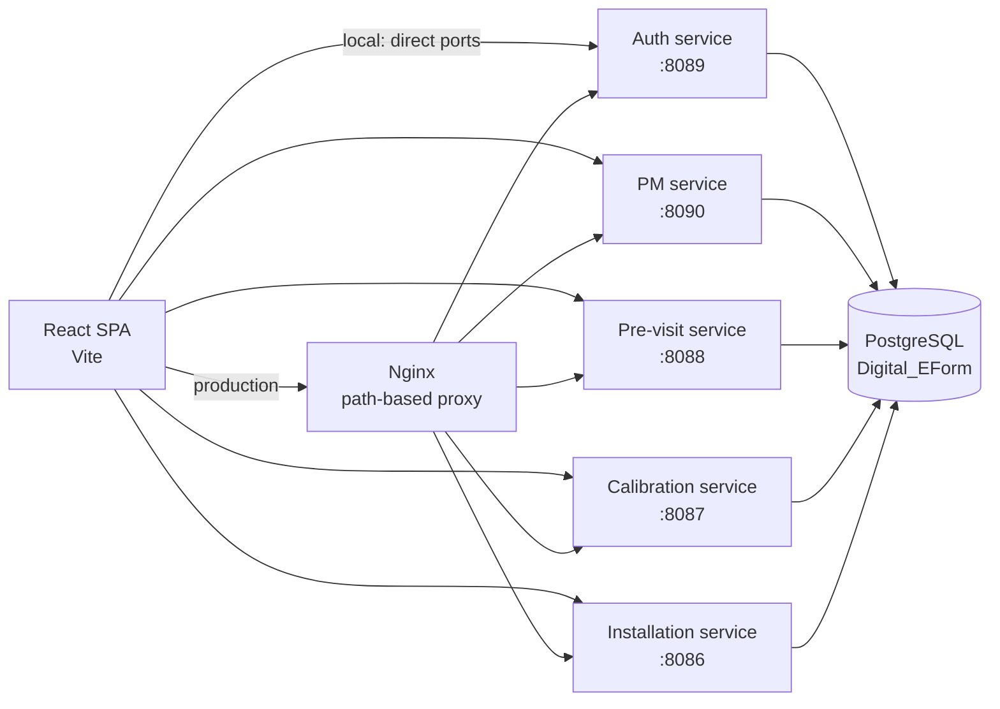

# Technical Interview Notes — Digital Installation & PM Visit E-Form System

Use this file to **explain the project in an interview**. It covers how the system works, why each technology exists, and short answers you can say out loud. Keep explanations simple first, then add detail if the interviewer asks.

The product itself is described in [`README.md`](README.md). This file is the **why and how**.

---

## Table of contents

- [One-minute pitch](#one-minute-pitch)
- [Problem we solved](#problem-we-solved)
- [Architecture (how to draw it)](#architecture-how-to-draw-it)
- [Why microservices](#why-microservices)
- [Request flow (end to end)](#request-flow-end-to-end)
- [Backend layered design](#backend-layered-design)
- [Authentication and JWT](#authentication-and-jwt)
- [Roles and authorization](#roles-and-authorization)
- [Database and JPA](#database-and-jpa)
- [The four report modules](#the-four-report-modules)
- [Frontend architecture](#frontend-architecture)
- [Images, signatures, and PDFs](#images-signatures-and-pdfs)
- [Notifications](#notifications)
- [Caching](#caching)
- [API Gateway vs Nginx](#api-gateway-vs-nginx)
- [Docker and production](#docker-and-production)
- [Technology choices — why each one](#technology-choices--why-each-one)
- [Design decisions and trade-offs](#design-decisions-and-trade-offs)
- [Likely interview questions](#likely-interview-questions)

---

## One-minute pitch

> “FloroSense field engineers used to fill paper checklists on site. I built a digital e-form platform so they can create, submit, and review four kinds of service reports from the browser: pre-visit, installation, calibration, and preventive maintenance.
>
> The UI is a **React** SPA. The backend is **five Spring Boot microservices** sharing **JWT auth** and one **PostgreSQL** database. In production, **Docker Compose** runs the APIs behind an **Nginx** reverse proxy. Admins can edit and delete reports; regular users can create and view them, and export a PDF.”

If they ask for one technical highlight:

> “Auth is **stateless JWT**. The auth service issues the token. Every report service verifies the same token with a shared secret, so the engineer logs in once and can call all five APIs.”

---

## Problem we solved

| Paper process | Digital system |
| --- | --- |
| Handwritten checklists on site | Structured forms with validation |
| Lost / unreadable copies | Reports stored in PostgreSQL |
| No search or counts | Dashboard counts, search, date filters |
| No access control | JWT + USER / ADMIN roles |
| Hard to share with office | Browser view + client-side PDF |

The business flow is a **site-visit lifecycle**:

1. **Pre-visit** — is the site ready (power, mounting, internet, LED, scope)?
2. **Installation & commissioning** — what was installed, with photos and dual sign-off?
3. **Calibration** — before/after readings against a master instrument?
4. **Preventive maintenance** — scheduled inspection checklist and status?

---

## Architecture (how to draw it)



**How to explain this drawing**

- The **browser never talks to PostgreSQL**. It only talks HTTP/JSON to APIs.
- **Locally**, Vite on port `5173` calls each service on its own port (`VITE_*_SERVICE_URL` in `frontend/.env`).
- **In production**, all five APIs sit on a Docker network. Only **Nginx on port 80** is public. It routes by URL path (`/api/auth` → auth, `/api/pm_reports` → PM, and so on).
- All services share one database named `Digital_EForm`, but **each module owns its own tables**. That is a shared-database microservice style, not “one database per service.”

---

## Why microservices

**Simple answer:** each report type is a separate product area. A bug in calibration should not take down login or PM.

**Full answer you can give:**

We split the backend into five Spring Boot apps:

| Service | Port | Owns |
| --- | --- | --- |
| Authentication-System | 8089 | Users, login, JWT, notifications |
| PM-Service-Reports | 8090 | Preventive maintenance reports |
| Pre-Visit-Report-Form | 8088 | Pre-visit checklists + site photos |
| Calibration-Report | 8087 | Calibration certificates |
| Installation-Commisioning-Report | 8086 | Installation reports + photos |

**Why not one monolith?**

- Teams / features can ship independently (PM wizard vs calibration form).
- Each service can scale or restart on its own.
- Different data shapes (PM has child checklists; calibration has UUID + nested readings; pre-visit has `bytea` images).
- Failure isolation: if installation is down, engineers can still log in and submit PM.

**Honest trade-off (interviewers like this):** we did **not** give each service its own database. They share PostgreSQL. That is simpler to operate on a small VPS, but it is weaker isolation than a textbook microservice. We still keep **table ownership** per service.

There is also an optional **Spring Cloud Gateway** (`Api-Gateway`, port `7070`) for local routing, and a **Thread-Starvation** library that can watch HikariCP / thread pools. Production traffic goes through **Nginx**, not the Java gateway.

---

## Request flow (end to end)

Walk this when they say “walk me through saving a report.”

```
1. Engineer opens /login
2. POST /api/auth/login  →  Authentication-System
   - Spring Security AuthenticationManager checks email + password
   - BCrypt matches the stored hash
   - JwtService builds a signed token (email, name, role, 24h expiry)
3. Frontend stores token, userName, userRole, userEmail in localStorage
4. Engineer fills the PM 6-step wizard  (state stays in React until the end)
5. POST /api/pm_reports  +  Authorization: Bearer <jwt>
   Local: http://localhost:8090
   Prod:  Nginx → pm container :8080
6. JwtAuthFilter verifies the signature and expiry
   - Puts ROLE_USER or ROLE_ADMIN into SecurityContext
7. Controller → Service → Mapper → Repository → PostgreSQL
   - Parent row in pm_reports
   - Child checklist rows (cascade)
   - Sign-off row (cascade)
8. Frontend invalidates list cache, shows a toast, creates a notification
9. Dashboard GET /api/pm_reports/count  (and the other /count endpoints)
```

**Images** (pre-visit / installation) are a **second request** after the report ID exists: `POST /images/upload/{reportId}` as multipart. Bytes go into PostgreSQL `BYTEA`, not a public S3 bucket.

---

## Backend layered design

Every service follows the same Spring layout. Say this as:

> “Controller never talks to the database. It receives a DTO, the service contains business logic, a mapper converts DTO ↔ entity, the repository is Spring Data JPA.”

```
HTTP JSON
   ↓
Controller     (@RestController, validation with @Valid)
   ↓
Service        (create / update / cache evict / cascade children)
   ↓
Mapper         (MapStruct on PM; manual mapping on others)
   ↓
Repository     (JpaRepository + custom @Query)
   ↓
Entity         (JPA / Hibernate → PostgreSQL)
```

**Why DTOs instead of exposing entities?**

- The JSON the UI sends is not the same shape as the tables (PM wizard sends nested `summary` + `checklists` + `signOff`).
- Entities have relationships (`@OneToMany`). Returning them raw can cause lazy-load / circular JSON problems.
- Validation (`@NotBlank`, `@Pattern`) belongs on the request DTO so bad input never becomes a half-saved entity.

**Why a GlobalExceptionHandler?**

`@RestControllerAdvice` turns exceptions into consistent JSON:

| Exception | HTTP status |
| --- | --- |
| `ResourceNotFoundException` | 404 |
| `MethodArgumentNotValidException` (Bean Validation) | 400 + field errors |
| Unexpected `Exception` | 500 with a generic message (no stack trace to the client) |

That is cleaner than try/catch in every controller method.

---

## Authentication and JWT

### What a JWT is (say this simply)

A JWT is three Base64 parts: **header.payload.signature**.

- **Payload** holds `sub` (email), `role`, `name`, `iat`, `exp`.
- **Signature** is HMAC-SHA with `JWT_SECRET`. If anyone tampers with the payload, verification fails.
- The token is **self-contained**. Report services do **not** call the auth service on every request. They only need the same secret.

### Why JWT (not server sessions)

| Sessions | JWT (what we use) |
| --- | --- |
| Server stores session in memory/Redis | No session store |
| Sticky sessions / shared cache needed | Any service can verify the token |
| Harder across five APIs | One login works for all five |

Spring Security is **stateless**: `SessionCreationPolicy.STATELESS`. CSRF is **disabled** because we do not use cookie-based session auth. The browser sends `Authorization: Bearer …` on each call. CSRF mainly matters when the browser automatically attaches cookies.

### Login path (auth service)

1. `AuthenticationManager.authenticate(email, password)`
2. `CustomUserDetails` loads the user from PostgreSQL
3. `BCryptPasswordEncoder.matches` (never store plain passwords)
4. `JwtService.generateToken(email, role, name)` — HS256, secret ≥ 32 bytes
5. Response: `{ token, role, name, email }`

Public endpoints: `/api/auth/register`, `/api/auth/login`, `/actuator/health`. Everything else, including `/api/notifications`, requires a valid token.

### How other services trust the token

Each report service has the **same** `JwtAuthFilter` (`OncePerRequestFilter`):

1. Read `Authorization` header.
2. If it starts with `Bearer `, parse and verify with `JWT_SECRET`.
3. Extract role. If it is `ADMIN`, set authority `ROLE_ADMIN` (Spring’s `hasRole("ADMIN")` expects that prefix).
4. Put `UsernamePasswordAuthenticationToken` into `SecurityContextHolder`.

**Interview point:** `JWT_SECRET` **must be identical** on all five services. If it differs, login works but PM/calibration calls return 401.

### Frontend session

- Token lives in **`localStorage`** (also `userName`, `userRole`, `userEmail`).
- Axios request interceptors attach `Authorization: Bearer <token>`.
- `ProtectedRoute` checks the token exists and `exp` is in the future (client-side decode of the payload — not a signature check).
- On **401** (not 403), `handleUnauthorizedResponse` clears storage and redirects to login. 403 means “logged in but not allowed”; we must **not** log the user out for that.

**Honest trade-off:** `localStorage` is simple and works well with a SPA + JWT header, but it is visible to XSS. HttpOnly cookies would be safer against XSS, but then we would need CSRF protection again. We mitigate XSS with normal React (no `dangerouslySetInnerHTML` for user HTML) and a 24-hour expiry.

---

## Roles and authorization

| Role | UI | API |
| --- | --- | --- |
| **USER** (default on signup) | Create + view + PDF | `GET` and `POST` |
| **ADMIN** | Also edit + delete | `PUT` / `PATCH` / `DELETE` require `ROLE_ADMIN` |

**Defense in depth** — say this; interviewers listen for it:

1. **Frontend:** `AdminRoute` wraps `/edit/:id`. Non-admins are redirected to the list. Buttons for delete can be hidden with `canModifyReports()`.
2. **Backend:** Spring Security `requestMatchers(HttpMethod.PUT/PATCH/DELETE, "/api/**").hasRole("ADMIN")`.

The UI check is for UX. The **API check is the real security**. Anyone can call the API with curl; without `ROLE_ADMIN` they get 403.

Signup accepts an optional role, then `normalizeRole()` only allows `USER` or `ADMIN`. Unknown values become `USER`.

---

## Database and JPA

**Why PostgreSQL**

- Relational data with parent/child reports (checklists, equipment, images).
- `BYTEA` for binary images.
- Unique constraints (email, phone, report numbers).
- Mature JDBC driver and Hibernate dialect.

**Shared database, separate tables**

Examples: `users`, `app_notifications`, `pm_reports`, `pm_sign_off`, `pre_visit_reports`, `previsit_site_images`, `calibration_reports`, `installation_reports`.

Hibernate `ddl-auto=update` creates/alters tables on startup. That is convenient for a small team iterating on entities. In a stricter production setup you would switch to Flyway/Liquibase migrations so schema changes are versioned.

**Cascade and orphanRemoval (PM example)**

`PreventiveMaintenanceReport` has:

- `@OneToMany` checklists with `cascade = ALL` and `orphanRemoval = true`
- `@OneToOne` sign-off with the same cascade

**How to explain cascade:** saving the parent saves children. Deleting the parent deletes children. `orphanRemoval` means if a checklist item is removed from the list, Hibernate deletes that row. That matches “one report is one document.”

**Enums:** PM status is `SATISFACTORY` / `FOLLOW_UP_VISIT_REQUIRED` / `REQUIRES_ATTENTION`, stored as VARCHAR via a converter so the DB stays readable.

**IDs:** most tables use `IDENTITY` (auto-increment `Long`). Calibration uses **UUID strings** because certificate records are treated as independent documents that may be referenced externally.

---

## The four report modules

### 1. Preventive Maintenance — 6-step wizard

**Why a wizard, not one long page?** A PM visit has many checklist sections. Splitting into steps reduces mistakes on a tablet in the field. Data stays in React `formData` until step 6 submits **one JSON** to `POST /api/pm_reports`.

| Step | What it captures |
| --- | --- |
| 1 Basic info | Client, site, sensor ID, engineer, date. Report no `PM-YYYY-XXXX`. Visit no `FESPL_{sensorId}_{count}` from live `GET /sensor/{id}/count` |
| 2 Inspection | Physical + power-supply Yes/No + remark |
| 3 Technical | Sensor health, communication, calibration check, cleaning |
| 4 Summary | Observations, recommendations, PM status, site condition |
| 5 Sign-off | Client + engineer names, dates, signatures |
| 6 Review | Full preview, then submit |

Checklist rows are stored as `PreventiveMaintenanceChecklist` with a `ChecklistCategory` enum. MapStruct (`PMMapper`) maps request DTO ↔ entity.

### 2. Pre-visit

Single-page form **before** installation. Six readiness flags (power, mounting, sensor location, internet, LED, client scope), each Yes/No + remark. Photos upload after create. Customer and technician signatures stored as TEXT (canvas data URL or typed name).

### 3. Calibration

Nested document: master reference instrument, readings **before** and **after**, summary flags, engineer declaration. Related rows use `@OneToOne(cascade = ALL)`. Certificate number from `ReportNumberGenerator` (`FLO_CAL_yyyyMMdd` + sequence). Due date typically +90 days.

### 4. Installation & commissioning

Equipment list is an `@ElementCollection` (separate `report_equipment_details` table). Work activities are booleans (unboxing, wiring, internet, safety briefing, …). Photos follow the same `BYTEA` pattern as pre-visit.

---

## Frontend architecture

**Stack in one sentence:** React 19 SPA built with Vite, routed by React Router 7, talking to APIs with Axios.

```
main.jsx          BrowserRouter
  App.jsx         Routes + NotificationProvider + ToastContainer
    ProtectedRoute / AdminRoute
      pages/      Dashboard, wizards, list/detail
      components/ PM steps, forms, lists
      services/   Axios clients (auth, notifications, each report type)
      config/env.js   Vite env → base URLs
```

**Why Vite:** fast HMR in development; `import.meta.env.VITE_*` bakes API origins into the production build. Changing hosts does not require editing source — only `.env` and a rebuild.

**Why React Router:** login/signup are public; everything else is behind `ProtectedRoute`. Edit URLs are a second gate (`AdminRoute`).

**Why Axios interceptors:** every service client attaches the JWT once. Failed 401s are handled in one place instead of in every `try/catch`.

**Forms:** PM keeps a single `formData` object lifted in `PMReportWizard`. Child steps receive `formData` + `setFormData`. That is **lifting state up** so Review can show everything without extra fetches.

**Validation:** client-side (required fields, report-number regex, Indian mobile `^[6-9]\d{9}$`) for instant feedback; server-side Bean Validation is the authority.

**UX libraries:** MUI for some controls, `react-datepicker` + `date-fns` for dates, `react-toastify` for success/error, `lucide-react` / `react-icons` for icons, `react-signature-canvas` where the user draws a signature.

---

## Images, signatures, and PDFs

### Site photos in the database

Pre-visit and installation store files as `byte[]` mapped to PostgreSQL `BYTEA` (`@Lob` + `BinaryJdbcType`).

**Why DB, not disk/S3 (for this project)?**

- One backup (pg_dump) includes reports **and** photos.
- Docker containers are disposable; a local folder can vanish on rebuild unless you bind-mount it.
- The API can return a Base64 data URI so the React view does not need a separate public file server.

**Cost:** large images inflate the DB and JSON payloads. Nginx `client_max_body_size` is **25 MB** so multipart uploads are not silently rejected. Compose still bind-mounts `./data/previsit-uploads` and `./data/installation-uploads` for temp/static serving.

### Signatures

Drawn on a canvas (`react-signature-canvas`) and saved as a string (often a PNG data URL in a TEXT column). Dual sign-off (customer + technician/engineer) is a **business rule**: the visit is not complete until both parties acknowledge the work.

### PDF export (client-side)

`html2canvas` snapshots the report DOM; `jsPDF` writes an A4 PDF. Some list views also use `jspdf-autotable`.

**Why client-side, not a Java PDF library?**

- No extra server CPU or PDF dependency on each microservice.
- The PDF looks like the on-screen report (what you see is what you print).
- Works even if the engineer is viewing a completed report and only needs a file to email.

**Limitation:** very long reports / CORS images need `useCORS: true`. Quality depends on the DOM, not a print stylesheet.

---

## Notifications

When a report is created/updated/deleted, the UI calls the **auth** service `POST /api/notifications`.

- Stored in `app_notifications` (type, audience, recipient email, report id/title, read flag).
- `NotificationProvider` (React Context) holds the feed, unread count, and mark-read / clear-all.
- Dashboard **polls every 20 seconds**.
- A copy is also kept in `localStorage` per email so the bell is not empty on refresh if the API is slow.

**Why Context, not prop drilling:** Navbar, Dashboard, and forms all need the same feed. Context is the shared client store for that.

**Why notifications live on the auth service:** they are user-centric (recipient email, read state), not report-centric. One inbox for all four report types.

This is **polling**, not WebSockets. Polling is simpler to deploy on a small VPS; 20s is “near real-time” for office admins.

---

## Caching

Three layers — mention this if they ask about performance.

| Layer | What | TTL / policy |
| --- | --- | --- |
| **Browser dashboard** | Report counts in `localStorage` | 2 hours |
| **Browser list pages** | `cache.js` (`app_cache:` keys) | 15 minutes, then invalidate on create/update/delete |
| **Spring Caffeine** | `@Cacheable` on list + count in report services | 10 minutes, max 500 entries; `@CacheEvict` on writes |

**How to explain Caffeine:** in-process cache. The next `GET /count` after a dashboard load hits memory instead of `COUNT(*)`. When someone saves a report, `@CacheEvict` drops those keys so the next read is fresh.

**Stale-data trade-off:** a second browser tab might show old counts until TTL or a manual refresh. That is acceptable for dashboard totals.

---

## API Gateway vs Nginx

**Spring Cloud Gateway** (`Api-Gateway`) is a Java reactive proxy (port 7070) useful in local microservice development.

**Production uses Nginx** because:

- It is a tiny Alpine container, not another JVM.
- Path routing is a few `location` blocks.
- Same place to terminate TLS later (`ssl_certificate` is ready to uncomment).
- Health: Compose waits until each API’s Actuator health is up before starting Nginx (`depends_on: condition: service_healthy`).

| Public path | Container |
| --- | --- |
| `/api/auth`, `/api/notifications` | `auth` |
| `/api/pm_reports` | `pm` |
| `/api/previsit-reports` | `previsit` |
| `/api/calibration-reports` | `calibration` |
| `/api/installation-reports` | `installation` |
| `/uploads/previsit-images/` | `previsit` |
| `/uploads/installation-images/` | `installation` |

Inside Docker, every API listens on **8080**. Host ports 8086–8090 are only for local `mvn spring-boot:run`.

---

## Docker and production

```
docker compose up -d --build
```

Runs `eform-auth`, `eform-pm`, `eform-previsit`, `eform-calibration`, `eform-installation`, `eform-nginx` on a bridge network `eform`. Postgres is typically on the host (`host.docker.internal`) via `SPRING_DATASOURCE_URL`.

The **frontend is built separately** (`npm run build`) and hosted as static files. `VITE_*_SERVICE_URL` must be the **public** API origin (the Nginx host). An HTTPS site cannot call HTTP APIs (browser mixed-content block).

**Why Docker:** same runtime on a laptop and a VPS; restart policies; isolated processes; Nginx as the only published port.

---

## Technology choices — why each one

Use this table when they ask “why this library?”

### Frontend

| Technology | Why it is required |
| --- | --- |
| **React 19** | Component UI for four large forms, lists, and a dashboard. State + routing fit a SPA. |
| **Vite 8** | Dev server and production bundle. Env-based API URLs without rebuilding a Java backend. |
| **React Router 7** | Login vs app vs admin edit URLs. |
| **Axios** | JSON + multipart to five origins; interceptors for JWT and 401. |
| **React Context** | Notification bell shared across pages. |
| **MUI** | Faster, accessible form controls where custom CSS would be slow to build. |
| **react-signature-canvas** | On-site dual sign-off without printing a paper form. |
| **html2canvas + jsPDF** | Engineer downloads a PDF of the filled report from the browser. |
| **date-fns / react-datepicker** | Visit dates, calibration due dates. |
| **react-toastify** | Immediate feedback after save/delete (field network can be slow). |

### Backend

| Technology | Why it is required |
| --- | --- |
| **Java 17 + Spring Boot 3.5** | REST APIs, dependency injection, production-ready defaults. |
| **Spring Security** | Filter chain, CORS, method/HTTP role checks, password encoding. |
| **JJWT 0.12.6** | Create and verify JWTs with HMAC. |
| **BCrypt** | Slow hash so leaked password tables are hard to crack. |
| **Spring Data JPA + Hibernate** | CRUD without hand-written SQL for every entity; relationships and cascade. |
| **PostgreSQL** | Relational integrity + `BYTEA` images. |
| **Bean Validation** | Reject bad report numbers / missing fields before persist. |
| **MapStruct (PM)** | Compile-time DTO mapping; less error-prone than manual setters. |
| **Lombok** | Less boilerplate on DTOs/entities in several modules. |
| **Caffeine** | Cheap in-memory cache for list/count endpoints. |
| **Spring Actuator** | `/actuator/health` for Docker healthchecks. |
| **Maven** | Standard Java build, Docker `mvn package`. |
| **Spring Mail (auth)** | Optional email from the auth service if configured. |

### Infrastructure

| Technology | Why it is required |
| --- | --- |
| **Docker Compose** | Run five APIs + Nginx with one command. |
| **Nginx** | Single public port, path routing, 25 MB uploads, future TLS. |
| **CORS config** | Browser on `localhost:5173` (or the hosted SPA origin) calling APIs on another origin. |

---

## Design decisions and trade-offs

Say a few of these unprompted — it shows you thought, not just followed a tutorial.

1. **Microservices + shared DB** — independent deploys and failure isolation, without operating five Postgres instances on a 4 GB VPS.
2. **Stateless JWT** — no session store; every service verifies locally. Revoking a token before 24h expiry would need a denylist we do not have yet.
3. **RBAC on HTTP methods** — USER can create; only ADMIN mutates. Enforced on the server.
4. **Wizard state client-side** — PM is one transaction at the end. If the browser closes mid-wizard, unsaved steps are lost (no draft table).
5. **Images in Postgres** — operational simplicity vs DB size.
6. **PDF in the browser** — no PDF service to maintain vs weaker print layout control.
7. **Nginx over Spring Cloud Gateway in prod** — fewer JVMs, enough routing for this app.
8. **`ddl-auto=update`** — fast iteration vs less control than versioned migrations.
9. **Polling notifications** — simple vs extra load; 20s is enough for this use case.

---

## Likely interview questions

### “What is the architecture?”

React SPA → (local ports or Nginx) → five Spring Boot services → one PostgreSQL. Auth issues JWT; report services verify it. See the diagram above.

### “How does authentication work across microservices?”

Shared `JWT_SECRET`. Auth signs; others verify in `JwtAuthFilter`. No synchronous call to auth on each request.

### “How do you protect edit and delete?”

Frontend `AdminRoute` plus Spring `hasRole("ADMIN")` on PUT/PATCH/DELETE. UI hiding is not security by itself.

### “Why disable CSRF?”

APIs are stateless JWT in the `Authorization` header, not cookie sessions. CSRF exploits cookie auto-send. We still configure CORS so only allowed origins can call the APIs from a browser.

### “How are report numbers unique?”

Formats like `PM-YYYY-XXXX` and calibration `FLO_CAL_yyyyMMdd` + sequence. DB unique constraints on report number columns. PM visit count comes from `COUNT` by `sensorId`.

### “How do you store images?”

Multipart upload after the report row exists. Bytes in `BYTEA`. GET returns Base64 for ``.

### “What happens if a token expires?”

JWT `exp` is 24 hours. `ProtectedRoute` and Axios 401 handler clear `localStorage` and send the user to `/login`.

### “How would you scale this?”

- Run more replicas of a busy service behind Nginx (need sticky-free JWT — we already have that).
- Move images to object storage if the DB grows.
- Replace notification polling with WebSockets or SSE.
- Split the database per service if teams and load grow.
- Add Flyway and stop using `ddl-auto=update` in production.

### “What would you improve next?”

Possible honest answers: refresh tokens + logout denylist; HttpOnly cookie option; draft-save for the PM wizard; Flyway; React Query (dependency is present but lists currently use a custom `localStorage` cache); tighter signup so clients cannot self-assign `ADMIN`.

### “Walk me through a class you wrote.”

Pick **JwtAuthFilter** or **PreventiveMaintenanceService** (save + cascade + cache evict) or **PMReportWizard** (lifted state, edit vs create). Explain input → steps → output, and one failure case (invalid token, validation error, 403).

---

## Quick glossary (if they use these words)

| Term | Meaning in this project |
| --- | --- |
| **SPA** | Single-page app: React handles routing in the browser. |
| **DTO** | JSON shape for the API, not the JPA entity. |
| **JPA / Hibernate** | Maps Java objects to tables. |
| **Cascade** | Save/delete parent also save/delete children. |
| **Stateless** | Server does not keep a login session; JWT carries identity. |
| **CORS** | Browser rule: frontend origin must be allowed by the API. |
| **Reverse proxy** | Nginx accepts public HTTP and forwards to the right container. |
| **Actuator health** | `/actuator/health` so Compose knows the API is ready. |
| **BYTEA** | PostgreSQL binary column for image bytes. |
| **RBAC** | Role-based access control (USER vs ADMIN). |

---

## How to practice

1. Draw the architecture from memory (browser, Nginx, five services, one DB).
2. Narrate login → JWT → POST PM report → cascade persist → notification.
3. Explain **one** trade-off (shared DB, localStorage JWT, or images in Postgres) and what you would change at larger scale.
4. Open `JwtAuthFilter`, `SecurityConfig` (PM `hasRole("ADMIN")`), and `PMReportWizard` once so you can point to real code if they ask.
)
